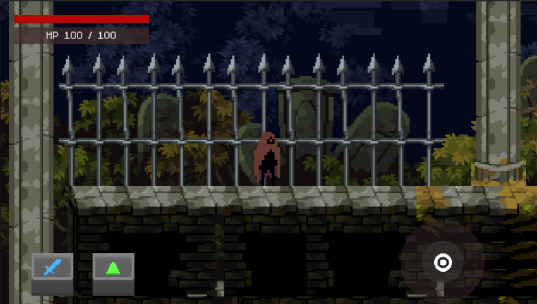

# Greed

## 介紹
- 用 Unity 做的 2D 平台動作遊戲
- 參考自 [這部教學](https://www.youtube.com/watch?v=oxiPWg8cdRM) 的概念
- 因為課程需求，主要 UI 是為手機用戶設計，但仍有提供鍵盤輸入

## 介面

- 左上角為血條
- 右下虛擬搖桿控制角色左右移動
- 左下按鈕分別為
  - 藍色劍按鈕：攻擊
  - 綠色三角按鈕：跳躍

## 目標
打敗最後的骷髏王再觸碰旗幟即可獲勝

## Asset 來源
- [流浪者](https://pixramen.itch.io/2d-action-platformer-sci-fi-vagabond)
- [女騎士(原本的玩家Sprite)](https://clembod.itch.io/warrior-free-animation-set)
- [騎士怪物](https://aamatniekss.itch.io/fantasy-knight-free-pixelart-animated-character)
- [飛行怪和骷髏](https://luizmelo.itch.io/monsters-creatures-fantasy)
- [Tileset](https://anokolisa.itch.io/moon-graveyard)